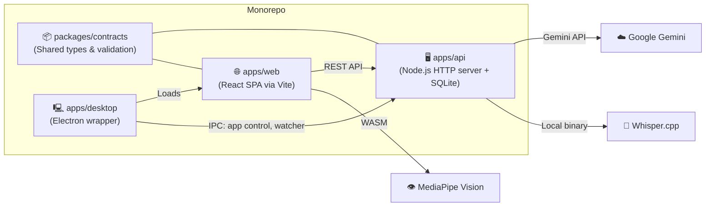
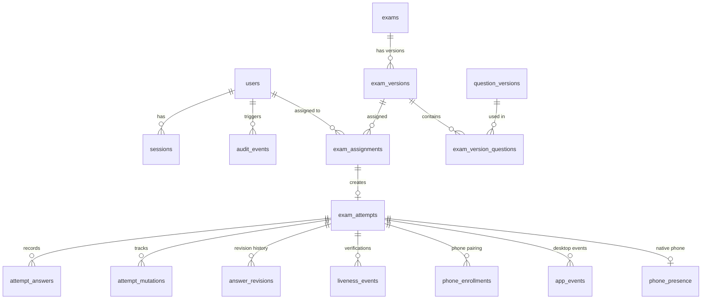

# 🏆 Hackathon Codebase Audit: Exam Anti-Cheat Platform

> **Project**: `exam-anti-cheat` — A consent-first browser exam-integrity prototype for classroom research
> **Stack**: TypeScript monorepo · React (Vite) · Raw Node.js HTTP server · SQLite · Electron · Gemini AI · Whisper.cpp · TensorFlow.js · MediaPipe
> **Source**: this repository (baseline commit)

---

## 📐 Architecture Overview



| Workspace | Purpose | Key Tech |
|-----------|---------|----------|
| `packages/contracts` | Shared types, validation, error handling | TypeScript, branded types |
| `apps/api` | Backend — auth, exam delivery, integrity, AI | Raw `node:http`, `node:sqlite`, Gemini, Whisper, TF.js |
| `apps/web` | Student-facing SPA — exam UI, integrity panels | React 19, Vite, MediaPipe WASM |
| `apps/desktop` | Lockdown browser shell | Electron, native `app-control` binary |

---

## ✅ Implemented Features (Complete & Working)

### 1. Authentication System
- **Session-based auth** with HTTP-only cookies (`eac_session`, `eac_csrf`)
- **Argon2id password hashing** via native Node.js `crypto.argon2`
- **CSRF protection** — double-submit cookie + session-bound token hash, timing-safe compare
- **CORS** — credentialed with explicit origin allowlist
- **Roles**: `student` / `instructor`
- **Full flow**: Register → Login → Session → CSRF rotation → Logout
- **Beautiful login UI** — split-panel design with brand intro + form card (1750+ lines of polished CSS)

> [!TIP]
> The auth system is production-grade. Reuse it wholesale for any authenticated app.

### 2. Exam Delivery Engine
- **Full lifecycle**: Create exam → Publish version → Assign to student → Start attempt → Save answers → Submit
- **5 question types**: Multiple choice, True/False, Identification, Numeric, Short answer
- **Idempotent saves** — revision-tracked with `idempotencyKey` deduplication ledger
- **Auto-expiration** — attempts expire at `effective_deadline`, enforced server-side
- **Extra time** support per assignment
- **Deterministic question ordering** via `attempt_seed`

### 3. AI-Powered Exam Generation
- **Gemini `gemini-3.6-flash`** generates 5-question exams on demand
- **Rotating API key pool** with retry on 429 + backoff
- **Fallback to static questions** if Gemini is unavailable
- **Duration estimation** via a second Gemini call
- **Concurrency guard** — one generation per student at a time

### 4. Integrity Monitoring Suite (12+ Signals)

| Signal | Location | Status |
|--------|----------|--------|
| **Tab guard** (triple-redundancy: localStorage + BroadcastChannel + Web Locks) | Web | ✅ Working |
| **Focus loss / Page hidden detection** | Web | ✅ Working |
| **Paste blocking** with toast notification | Web | ✅ Working |
| **Keystroke dynamics** (dwell/flight timing, bot detection via CV < 0.1) | Web | ✅ Working |
| **Camera face detection** (MediaPipe FaceDetection WASM) | Web | ✅ Working |
| **Head pose estimation** (yaw/pitch from face landmarks) | Web | ✅ Working |
| **Phone detection** in camera feed | Web | ✅ Working |
| **Earbuds / Smart glasses detection** | Web | ✅ Working |
| **Low light detection** (luminance < 45 threshold) | Web | ✅ Working |
| **Cluely/overlay detector** (invisible iframe detection) | Web | ✅ Working |
| **Audio monitoring** (built-in mic voice activity detection) | Web | ✅ Working |
| **Ultrasound beacon** (19kHz tone for phone proximity) | Web | ✅ Working |
| **Liveness challenges** (flash brightness + gesture via TF.js hand pose) | Web + API | ✅ Working |
| **Screen recording** (local download, 720p/5fps, 1-min segments) | Web (Electron) | ✅ Working |
| **Foreground app monitoring** (macOS `lsappinfo`) | Desktop | ✅ Working |
| **Display count monitoring** | Desktop | ✅ Working |

### 5. Phone Presence System
- **Native phone pairing** — QR code with pairing hash
- **Challenge/response heartbeat** — credential-based, lease-expiry model
- **Answer gate** — blocks saving if phone disconnects
- **Cooperative design** — not a "gotcha", includes clear student messaging

### 6. AI Text Detection
- **Gemini-powered** analysis of student answers for AI-generated text patterns
- Returns `score` (0.0–1.0), `flaggedPhrases`, and `summary`

### 7. Audio Transcription Pipeline
- **Whisper.cpp** (vendored, base model) for local speech-to-text
- **Pipeline**: Base64 audio → temp file → `ffmpeg` → 16kHz WAV → Whisper CLI → transcript
- 5-second clips, capture-then-process cycle

### 8. Desktop Lockdown Browser
- **Electron shell** with content protection, navigation restrictions
- **Pre-flight security gate** — detects and requests closure of risky apps (Chrome, Discord, Zoom, OBS, etc.)
- **Native app control** — quit/force-quit via IPC to Swift binary
- **Recovery system** — handles renderer crashes, load failures, unresponsive windows
- **Screen picker** — user-consented display selection for recording
- **Emergency exit** — Cmd+Shift+Q

### 9. Violation & Kick System
- **Threshold-based kick**: duplicate_tab=1, focus_lost=5, page_hidden=3, fullscreen_exit=3, paste=10, overlay=1
- **Violation banner** with count
- **Terminal kick screen** with back-to-assignments

### 10. Consent-First Design
- **Detailed consent modal** before exam start — lists all monitoring (camera, audio, browser, recording, AI check)
- **Hardware permission gate** — camera + mic must be granted before proceeding

### 11. Answer Similarity Detection (Backend-only)
- **Gemini Embeddings** (`gemini-embedding-exp-03-07`) for cosine similarity
- **Threshold**: 0.92
- **Status**: Implemented but **not wired to any route** (see Bugs)

### 12. Question Watermarking
- **Zero-width Unicode steganography** — encodes `attemptId` as invisible characters (U+200B / U+200C) appended to question prompts
- Allows tracing screenshots/leaks back to specific attempts

---

## 🐛 Known Bugs & Issues

### Critical Bugs

| # | Bug | File | Impact |
|---|-----|------|--------|
| 1 | **Wrong table name**: `getPhoneEnrollmentByAttempt()` queries `integrity_phone_enrollments` but the table is `phone_enrollments` | [integrityRepository.ts](apps/api/src/integrityRepository.ts#L194) | 💥 Runtime crash on phone status check |
| 2 | **Double-escaped newlines** in JSON protocol with Python YOLO server (`'\\\\n'` instead of `'\\n'`) | [backendVision.ts](apps/api/src/backendVision.ts#L15) | Broken vision protocol parsing |
| 3 | **Events endpoint has NO authentication** — any request can inject fake app events for any attempt | [exam.routes.ts](apps/api/src/exam.routes.ts) | 🔓 Security vulnerability |
| 4 | **AI check endpoint doesn't verify answer ownership** — any student can check arbitrary text | [exam.routes.ts](apps/api/src/exam.routes.ts) | 🔓 Security vulnerability |

### Performance Issues

| # | Issue | Impact |
|---|-------|--------|
| 5 | **Whisper single-concurrency** — global `busy` flag, one transcription at a time across ALL students | All other students get 503 during processing |
| 6 | **Vision promise clobber** — overlapping requests silently reject previous ones, no queue | Lost detection results |

### Dead Code / Unfinished

| # | Code | Status |
|---|------|--------|
| 7 | `backendVision.ts` (OWL-ViT/YOLO) | Defined but **never imported or called** from any route |
| 8 | `similarity.ts` (cross-student collusion) | Fully implemented but **never called** from any route |
| 9 | `telemetryPattern` / `transpPattern` regexes | Defined but **no route handlers match** them |
| 10 | `getTransparencyReport()` | Exists in service but **no route** calls it |
| 11 | `signNonce()` in liveness.ts | Exported but **never called** |
| 12 | `SimilarityDashboard.tsx` | Admin UI scaffold with **hardcoded fake data** |
| 13 | `isExamPath()` missing patterns | Vision, telemetry, transparency, recording, speedtest patterns **not included** → CORS preflight 404s |

---

## 🗄️ Database Schema (SQLite — 5 Migrations)



**Key tables**: `users`, `sessions`, `exams`, `exam_versions`, `question_versions`, `exam_assignments`, `exam_attempts`, `attempt_answers`, `attempt_mutations`, `answer_revisions`, `liveness_events`, `phone_enrollments`, `phone_presence`, `app_events`, `keystroke_events`, `gaze_events`, `voice_events`, `audio_sessions`, `liveness_challenges`

> [!NOTE]
> All tables have immutability triggers on published exam data. Terminal attempt states (submitted/expired) are also immutable.

---

## 🔌 API Endpoints Summary (30+ Routes)

### Auth (`/auth/*`)
| Method | Path | Description |
|--------|------|-------------|
| GET | `/auth/csrf` | Get CSRF token |
| POST | `/auth/register` | Create account |
| POST | `/auth/login` | Authenticate |
| POST | `/auth/logout` | End session |
| GET | `/auth/me` | Current user |

### Exam (`/exam/*`)
| Method | Path | Description |
|--------|------|-------------|
| GET | `/exam/assignments` | List student assignments |
| POST | `/exam/assignments/:id/start` | Start exam attempt |
| GET | `/exam/attempts/:id` | Get exam delivery |
| PUT | `/exam/attempts/:id/answers` | Save answers (idempotent) |
| POST | `/exam/attempts/:id/submit` | Submit attempt |
| POST | `/exam/generate` | AI-generate new exam |
| POST | `/exam/attempts/:id/liveness-challenge` | Issue liveness challenge |
| POST | `/exam/attempts/:id/liveness-verify` | Verify liveness response |
| POST | `/exam/attempts/:id/ai-check` | AI text detection |
| POST | `/exam/attempts/:id/audio` | Whisper transcription |
| POST | `/exam/attempts/:id/recording` | Upload video chunk |
| POST | `/exam/attempts/:id/enroll-phone` | Legacy phone enrollment |
| GET | `/exam/attempts/:id/phone-status` | Phone heartbeat status |
| POST/GET | `/exam/attempts/:id/phone-presence` | Native phone presence |
| POST | `/exam/phone-presence/claim` | Phone claims pairing |
| POST | `/exam/phone-presence/heartbeat` | Phone heartbeat |
| PATCH | `/exam/attempts/:id/events` | Record desktop events |
| POST | `/exam/speedtest` | Network speed test |
| GET | `/exam/attempts/:id/revisions` | Answer revision history |

---

## 🧰 What You Can Reuse for the Hackathon

### Tier 1: Ready to Go (Copy & Build On)
These are complete, tested, and production-quality:

1. **Full auth system** — session cookies, Argon2id, CSRF, CORS
2. **SQLite migration system** — clean schema with immutability triggers
3. **Shared contracts package** — branded types, `DomainError`, `ProblemDetails`, validation
4. **Exam API client** (`apps/web/src/features/exam/api.ts`) — robust typed fetch wrapper with sanitization
5. **Auth API client + AuthProvider** — React context with login/register/logout/refresh
6. **CSS design system** — 1750+ lines of polished, responsive UI (auth, cards, modals, exam shell)
7. **Tab guard** — triple-redundancy singleton enforcement
8. **Keystroke dynamics** — biometric typing pattern analysis
9. **Consent modal pattern** — checklist + hardware permission gate
10. **Electron desktop shell** — content protection, recovery, permission handling

### Tier 2: Needs Minor Fixes
1. **Phone presence system** — fix table name bug (#1 above) and it works
2. **Events endpoint** — add `requireStudent()` auth check
3. **Similarity detection** — wire to a route endpoint
4. **Telemetry endpoint** — connect the existing patterns to handlers

### Tier 3: Scaffolded / Partially Done
1. **Admin similarity dashboard** — UI exists, needs real API integration
2. **Backend vision** (YOLO server) — code exists but never connected
3. **Transparency reports** — service method exists, no route
4. **Cloud recording upload** (OneDrive/MS Graph) — partial, needs token config

---

## 🛠️ Dev Workflow

```bash
# Prerequisites
node >= 24.7.0, npm >= 10.0.0

# Install
npm install

# Run everything (API + Web dev servers)
npm run dev

# Individual servers
npm run dev:api    # API on port 3000
npm run dev:web    # Vite on port 5173

# Seed demo data
npm run demo:seed

# Test
npm test           # All tests
npm run test:api   # API tests only
npm run test:web   # Web tests only
npm run test:e2e   # Playwright E2E

# Validate (format + lint + typecheck + test)
npm run validate
```

### Environment Variables
- `GEMINI_API_KEY` / `GEMINI_API_KEYS` — comma-separated Gemini keys
- `ENABLE_FRESH_EXAM_GENERATION` — enable AI exam generation endpoint
- `WHISPER_BIN` — path to whisper-cli binary
- `WHISPER_MODEL_PATH` — path to ggml model
- `FFMPEG_BIN` — path to ffmpeg
- `WHISPER_USE_GPU` — enable GPU for Whisper
- `MS_GRAPH_*` — Microsoft Graph credentials for cloud recording

---

## 💡 Hackathon Reuse Strategy

> [!IMPORTANT]
> **For a 21-hour hackathon**: Don't rebuild auth, don't rebuild the API framework, don't rebuild the exam delivery engine. Fork this codebase, strip or rename the exam-specific parts, and build your new features on top of the solid foundation.

### What to keep as-is:
- Auth system (register/login/session/CSRF)
- Database migration infrastructure
- React app shell + CSS design system
- Shared contracts package pattern
- API client pattern with typed validation

### What to retheme/rename:
- `exam-anti-cheat` → your project name
- Exam-specific routes → your domain routes
- Question types → your data model

### What to strip if not relevant:
- Whisper.cpp vendor directory (large)
- Electron desktop app (if web-only)
- MediaPipe WASM assets (if no vision)
- Phone presence system (if not needed)

### Quick wins to demo:
- The **polished login/register UI** is impressive out of the box
- The **consent-first modal** pattern works for any privacy-sensitive app
- The **real-time integrity monitoring** (camera + audio + keystroke) is demo gold
- **AI exam generation** with Gemini — set up keys and it works instantly
